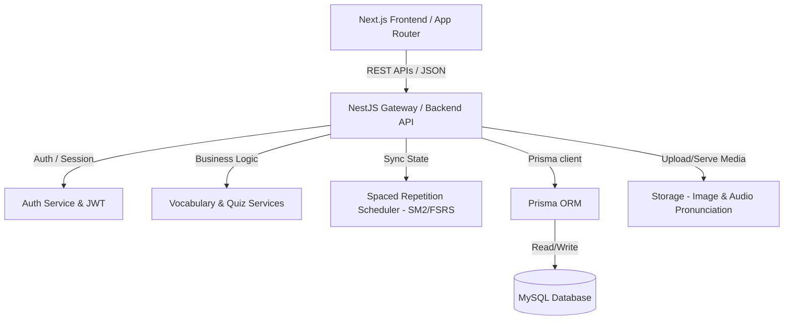

# Bản Thiết Kế Hệ Thống & Kế Hoạch Triển Khai Website Học 3000 Từ Vựng Oxford (Phiên bản Tinh gọn)

Bản thiết kế này tập trung tối đa vào các chức năng cốt lõi: học từ vựng, kiểm tra đánh giá (12 dạng bài tập) và theo dõi tiến độ học tập cá nhân. Các tính năng phụ trợ, âm thanh (sound effects) và hiệu ứng chuyển động (animations) phức tạp đã được lược bỏ để tối ưu hóa thời gian triển khai và tập trung vào tính hiệu quả, ổn định của hệ thống.

---

## 1. Kiến Trúc Tổng Quan (System Architecture)

Hệ thống áp dụng kiến trúc **Client-Server** phân tách hoàn chỉnh:



- **Frontend**: Next.js (React), TypeScript, Tailwind CSS (hoặc CSS Modules), Zustand (Quản lý trạng thái Client), TanStack Query (quản lý Cache & Sync API).
- **Backend**: NestJS, TypeScript, JWT Authentication, Class Validator.
- **Database & Storage**: MySQL (quản lý dữ liệu quan hệ), Prisma ORM, Local Storage hoặc S3/Cloudinary để lưu hình ảnh và file audio phát âm mẫu (giọng đọc từ vựng có sẵn từ nguồn tài liệu).

---

## 2. Thiết Kế Cơ Sở Dữ Liệu (Database Schema)

Dưới đây là thiết kế Schema sử dụng cú pháp **Prisma ORM**.

```prisma
datasource db {
  provider = "mysql"
  url      = env("DATABASE_URL")
}

generator client {
  provider = "prisma-client-js"
}

// 1. Người dùng
model User {
  id            String         @id @default(uuid())
  email         String         @unique
  passwordHash  String
  fullName      String
  avatarUrl     String?
  role          Role           @default(USER)
  createdAt     DateTime       @default(now())
  updatedAt     DateTime       @updatedAt

  // Quan hệ
  progresses    UserProgress[]
  favorites     UserFavorite[]
  quizAttempts  QuizAttempt[]
  schedules     ReviewSchedule[] // Lịch ôn tập Spaced Repetition

  @@index([email])
}

enum Role {
  USER
  ADMIN
}

// 2. Chủ đề học tập
model Topic {
  id          String       @id @default(uuid())
  title       String       // VD: Family, Technology, Travel...
  slug        String       @unique
  description String?
  imageUrl    String?
  orderIndex  Int          // Dùng để sắp xếp các chủ đề theo lộ trình
  isActive    Boolean      @default(true)
  createdAt   DateTime     @default(now())
  updatedAt   DateTime     @updatedAt

  // Quan hệ
  vocabularies Vocabulary[]
}

// 3. Từ vựng (Oxford 3000)
model Vocabulary {
  id              String           @id @default(uuid())
  word            String           // Từ tiếng Anh (VD: abandon)
  partOfSpeech    String           // Loại từ (VD: v, n, adj, adv)
  ipa             String           // Phiên âm (VD: /əˈbændən/)
  meaningVi       String           // Nghĩa tiếng Việt
  imageUrl        String?          // Ảnh minh họa trực quan
  audioUrl        String?          // File phát âm giọng Anh-Anh hoặc Anh-Mỹ
  exampleSentence String           // Câu ví dụ (Tiếng Anh)
  exampleMeaning  String           // Dịch nghĩa câu ví dụ (Tiếng Việt)
  exampleTense    String?          // Thì sử dụng trong câu ví dụ (VD: Present Simple, Past Simple...)
  orderNumber     Int              // Thứ tự hiển thị (từ 1 đến 3000+)
  topicId         String
  createdAt       DateTime         @default(now())

  // Quan hệ
  topic           Topic            @relation(fields: [topicId], references: [id], onDelete: Cascade)
  progresses      UserProgress[]
  favorites       UserFavorite[]
  reviewSchedules ReviewSchedule[]

  @@index([word])
  @@index([topicId])
}

// 4. Tiến độ học của người dùng
model UserProgress {
  id           String     @id @default(uuid())
  userId       String
  vocabularyId String
  isLearned    Boolean    @default(false)
  learnedAt    DateTime?
  updatedAt    DateTime   @updatedAt

  // Quan hệ
  user         User       @relation(fields: [userId], references: [id], onDelete: Cascade)
  vocabulary   Vocabulary @relation(fields: [vocabularyId], references: [id], onDelete: Cascade)

  @@unique([userId, vocabularyId])
  @@index([userId])
}

// 5. Từ vựng yêu thích/Từ khó cần lưu ý
model UserFavorite {
  id           String     @id @default(uuid())
  userId       String
  vocabularyId String
  createdAt    DateTime   @default(now())

  // Quan hệ
  user         User       @relation(fields: [userId], references: [id], onDelete: Cascade)
  vocabulary   Vocabulary @relation(fields: [vocabularyId], references: [id], onDelete: Cascade)

  @@unique([userId, vocabularyId])
  @@index([userId])
}

// 6. Lịch sử bài kiểm tra
model QuizAttempt {
  id            String   @id @default(uuid())
  userId        String
  topicId       String
  score         Float    // Điểm số (%)
  totalQuestions Int
  correctAnswers Int
  wrongAnswers  Int
  duration      Int      // Thời gian làm bài (tính bằng giây)
  completedAt   DateTime @default(now())

  // Quan hệ
  user          User     @relation(fields: [userId], references: [id], onDelete: Cascade)
  wrongWords    QuizAttemptWrongWord[]

  @@index([userId, topicId])
}

// 7. Lưu vết các từ trả lời sai trong bài test để ôn tập
model QuizAttemptWrongWord {
  id            String      @id @default(uuid())
  attemptId     String
  vocabularyId  String

  // Quan hệ
  attempt       QuizAttempt @relation(fields: [attemptId], references: [id], onDelete: Cascade)

  @@unique([attemptId, vocabularyId])
}

// 8. Lịch ôn tập Spaced Repetition (Lặp lại ngắt quãng - SM-2)
model ReviewSchedule {
  id            String     @id @default(uuid())
  userId        String
  vocabularyId  String
  interval      Int        @default(1)     // Khoảng thời gian cho lần ôn tiếp theo (ngày)
  easeFactor    Float      @default(2.5)   // Hệ số dễ (chỉ áp dụng nếu dùng SM-2)
  repetitions   Int        @default(0)     // Số lần đã ôn tập thành công liên tiếp
  dueDate       DateTime   @default(now()) // Ngày/Giờ cần ôn tập lại
  lastReviewed  DateTime?

  // Quan hệ
  user          User       @relation(fields: [userId], references: [id], onDelete: Cascade)
  vocabulary    Vocabulary @relation(fields: [vocabularyId], references: [id], onDelete: Cascade)

  @@unique([userId, vocabularyId])
  @@index([userId, dueDate])
}
```

---

## 3. Thiết Kế API (Backend API Design)

Các API được thiết kế theo chuẩn RESTful:

### Nhóm Auth & User
- `POST /api/auth/register`: Đăng ký tài khoản.
- `POST /api/auth/login`: Đăng nhập & trả về Access Token.
- `GET /api/user/profile`: Lấy thông tin cá nhân.
- `GET /api/user/dashboard`: Lấy thông số thống kê tổng quan (Số từ đã học, số chủ đề đã hoàn thành, lịch sử thi gần đây).

### Nhóm Vocabulary & Topic
- `GET /api/topics`: Lấy danh sách chủ đề và phần trăm tiến độ hoàn thành.
- `GET /api/topics/:slug/vocabularies`: Lấy danh sách từ vựng của chủ đề.
- `POST /api/vocabularies/:id/learn`: Đánh dấu từ đã học (Lưu vào `UserProgress`).
- `POST /api/vocabularies/:id/favorite`: Thêm/Xóa từ khỏi danh sách yêu thích/cần lưu ý.

### Nhóm Spaced Repetition (Lặp lại ngắt quãng)
- `GET /api/reviews/due`: Lấy danh sách các từ vựng cần ôn tập hôm nay.
- `POST /api/reviews/:id/grade`: Gửi kết quả đánh giá chất lượng ghi nhớ (để tính toán lịch ôn tập tiếp theo).

### Nhóm Quiz (Bài kiểm tra)
- `GET /api/topics/:id/quiz/generate`: Tạo câu hỏi ngẫu nhiên dựa trên 12 dạng đề cho chủ đề đó.
- `POST /api/quiz/submit`: Nộp bài kiểm tra, chấm điểm, lưu lịch sử và danh sách từ làm sai.

---

## 4. Thiết Kế Quiz Engine (12 Dạng Bài Tập Cốt Lõi)

Quiz Engine hoạt động bằng cách render động giao diện dựa trên loại câu hỏi (`type`) nhận được từ API:

| STT | Loại Bài Tập (Type) | Mô tả giao diện & tương tác đơn giản |
| :--- | :--- | :--- |
| **1** | `EN_TO_VI_TEXT` | Hiện từ tiếng Anh $\rightarrow$ Nhập nghĩa tiếng Việt (Input text tiêu chuẩn). |
| **2** | `VI_TO_EN_TEXT` | Hiện nghĩa tiếng Việt $\rightarrow$ Nhập từ tiếng Anh (Input text). |
| **3** | `MULTIPLE_CHOICE_4` | Trắc nghiệm 4 đáp án (4 nút bấm lớn). |
| **4** | `PART_OF_SPEECH` | Chọn đúng loại từ (Noun, Verb, Adjective, Adverb...) dưới dạng các nút lựa chọn. |
| **5** | `FILL_IN_BLANK` | Điền từ còn thiếu vào câu ví dụ (Input chèn trực tiếp trong câu). |
| **6** | `CHOOSE_CORRECT_WORD` | Chọn từ đúng từ danh sách dropdown hoặc danh sách nút để hoàn thành câu. |
| **7** | `MATCH_WORD_MEANING` | Ghép từ với nghĩa: Click chọn 1 từ tiếng Anh bên cột A, click tiếp 1 nghĩa tiếng Việt ở cột B để kết nối chúng. |
| **8** | `MATCH_WORD_IMAGE` | Chọn hình ảnh đúng tương ứng với từ vựng được yêu cầu. |
| **9** | `WORD_REORDER` | Sắp xếp các từ thành câu hoàn chỉnh bằng cách click chọn các thẻ từ theo thứ tự để chúng tự động điền vào ô trống (không cần kéo thả kéo dài phức tạp). |
| **10** | `TRUE_FALSE_MEANING` | Nút Đúng / Sai về nghĩa của từ. |
| **11** | `IDENTIFY_TENSE` | Trắc nghiệm chọn thì ngữ pháp trong câu ví dụ. |
| **12** | `WRITE_NEW_SENTENCE` | Ô nhập liệu cho người dùng tự viết câu mới. Hiển thị gợi ý/đáp án tham khảo mẫu bên cạnh để tự so sánh (không cần tích hợp AI phức tạp để chấm điểm). |

---

## 5. Thuật Toán Lặp Lại Ngắt Quãng (SM-2)

Hệ thống áp dụng thuật toán **SM-2** tiêu chuẩn để lên lịch ôn tập cho các từ vựng người dùng đã học.

Khi người dùng đánh giá mức độ nhớ từ (từ 0 đến 5):
1. Nếu điểm đánh giá $q < 3$: Thiết lập lại `repetitions = 0`, `interval = 1` ngày.
2. Nếu $q \ge 3$:
   - Nếu `repetitions = 0` $\rightarrow$ `interval = 1` ngày.
   - Nếu `repetitions = 1` $\rightarrow$ `interval = 6` ngày.
   - Nếu `repetitions > 1` $\rightarrow$ `interval = interval * easeFactor`.
   - Tăng `repetitions` lên 1 đơn vị.
3. Cập nhật Ease Factor: $EF_{new} = EF_{old} + (0.1 - (5 - q) \times (0.08 + (5 - q) \times 0.02))$. (Giá trị tối thiểu là 1.3).

---

## 6. Thiết Kế UI/UX Đơn Giản & Tối Ưu

- **Theme & Layout**: Sử dụng giao diện sạch sẽ, gọn gàng với màu chủ đạo dịu mắt (ví dụ: xanh dương Indigo phối xám nhạt). Tránh các hiệu ứng chuyển động phức tạp.
- **Tính năng học tập**:
  - Giao diện học từ vựng (Card view): Hiển thị từ vựng, phiên âm, loại từ, nghĩa, câu ví dụ và nghĩa ví dụ. Có nút "Xem từ trước", "Từ tiếp theo", "Đánh dấu đã học" và "Yêu thích".
  - Chuyển slide từ vựng mượt mà bằng CSS transitions đơn giản.
- **Tính năng kiểm tra**:
  - Giao diện làm bài tập tập trung (Focus mode). Một thanh tiến trình (progress bar) dạng dẹt đơn giản chạy từ trái qua phải tương ứng với số câu hỏi đã làm.
  - Khi hoàn thành, hiển thị trực tiếp bảng thống kê điểm số, thời gian, số câu đúng/sai và danh sách từ vựng bị trả lời sai để nhấn vào xem lại.

---

## 7. Chiến Lược Hiệu Năng & Bảo Mật

- **Static Generation**: Next.js sử dụng Server Components để render danh sách các chủ đề tĩnh nhằm tối ưu tốc độ tải trang ban đầu.
- **Data Validation**: Xác thực chặt chẽ đầu vào ở phía NestJS sử dụng `ValidationPipe` của NestJS.
- **Database Optimization**: Đánh chỉ mục (Index) trên các quan hệ khóa ngoại (`userId`, `topicId`) giúp tối ưu hóa tốc độ truy vấn cơ sở dữ liệu khi lượng dữ liệu tiến độ tăng lên.

---

## 8. Kế Hoạch Xác Minh & Kiểm Thử (Verification Plan)

### Kiểm thử tự động (Automated Tests)
- Viết unit test cho hàm tính toán khoảng cách ôn tập SM-2 ở Backend để đảm bảo logic lịch hẹn hoạt động đúng.

### Kiểm thử thủ công (Manual Verification)
- Kiểm tra hiển thị giao diện trên trình duyệt Chrome, Safari và các thiết bị di động (Responsive Layout).
- Thử nghiệm làm một bài test từ đầu đến cuối để đảm bảo dữ liệu ghi nhận đầy đủ vào DB sau khi nộp bài.
